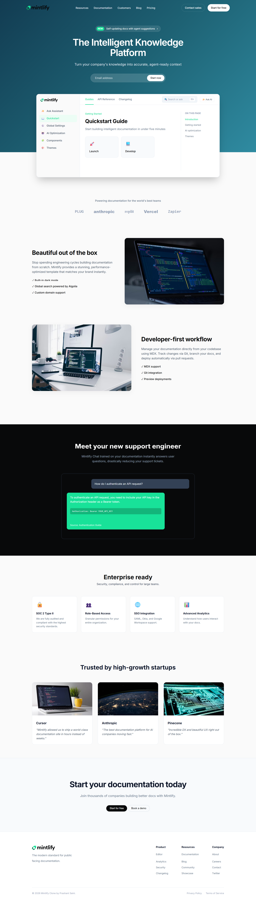

# Mintlify Landing Page Clone

> **Web Dev Cohort 2026 - Peer Review Assignment**  
> **Author:** Prashant Saini  
> **Tech Stack:** Vanilla HTML5 & CSS3 (No Frameworks)

---

## 📌 Project Overview

This project is a high-fidelity, responsive clone of the Mintlify documentation website. It was built entirely from scratch using pure HTML and CSS to demonstrate proficiency in modern web layouts, CSS Grid/Flexbox architectures, and strict adherence to brand guidelines.

## ⚙️ Technical Specifications

### Architecture & Layout
- **Semantic HTML5:** Structured with clear landmark elements (`<header>`, `<nav>`, `<main>`, `<section>`, `<footer>`).
- **CSS Flexbox & Grid:** Utilized for complex alignments, specifically within the overlapping documentation UI mockup and the multi-column footer.
- **Fully Responsive:** Comprehensive media queries implemented for Desktop (`>1024px`), Tablet (`768px - 1024px`), and Mobile (`<480px`).
- **Zero Dependencies:** No Tailwind, Bootstrap, or JavaScript were used, strictly adhering to assignment constraints.

### Brand Guidelines Implemented
All brand assets and colors were strictly implemented according to the provided specification:
- **Primary Brand (Mountain Meadow):** `#18E299`
- **Dark Elements (Woodsmoke):** `#08090A`
- **Base UI (White):** `#FFFFFF`
- **Typography:** `Inter` (Google Fonts)

## 🏗️ Components Developed

The following 10 core sections were successfully recreated:
1. **Global Navigation:** Responsive top bar with brand SVG logo and CTA buttons.
2. **Hero Section:** CSS-generated linear gradient background (`#123c52` to `#2f8ba1`), typography hierarchy, and email capture form.
3. **Floating Docs Preview:** A purely CSS-constructed overlapping UI window simulating the Mintlify documentation dashboard (Sidebar, Search, Guides).
4. **Trusted Partners:** Grid-based logo showcase.
5. **Feature Showcases:** Alternating text and visual layouts utilizing `flex-direction: row-reverse`.
6. **Intelligent Assistant:** Recreated chat-interface mockup using CSS bubbles.
7. **Enterprise Features:** 4-column responsive grid layout.
8. **Case Studies:** Card-based testimonials for Anthropic, Cursor, and Pinecone.
9. **Pre-Footer CTA:** High-contrast call-to-action banner.
10. **Site Footer:** Multi-column navigational links.

## 🚀 Setup Instructions
To view this project locally:
1. Clone this repository.
2. Open `index.html` in any modern web browser or use an extension like VS Code Live Server.
3. No build steps or installations required.
